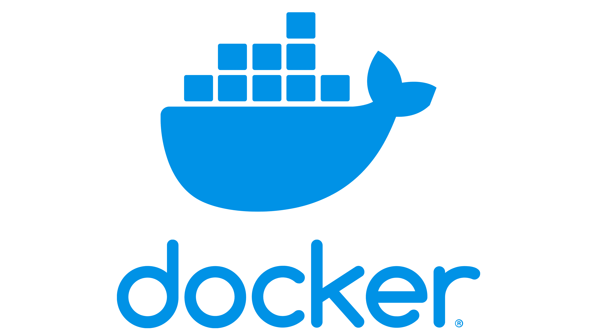
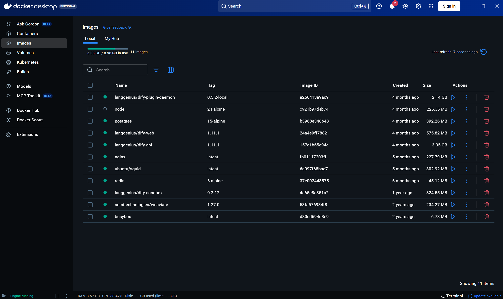

# Docker Desktop 安装与配置指南 

> 本指南适用于 Windows 系统。

## 核心概念
Docker 是一个用于开发、发布和运行应用程序的开放平台。它能将应用与依赖环境打包成容器，实现**一次构建，处处运行**。

## 下载与安装
1.  **官方下载**：强烈建议从 [Docker 官方文档站](https://docs.docker.com/desktop/install/windows-install/) 获取最新稳定版安装程序。
2.  **系统要求**：确保你的 Windows 10/11 已启用 **WSL 2** 或 **Hyper-V** 功能。（开启虚拟化）
3.  **安装步骤**：双击下载的 `Docker Desktop Installer.exe`，按提示完成安装，安装后需**重启电脑**。

## 基础使用验证
安装完成后，在终端（PowerShell 或 CMD）中运行以下命令验证：
```bash
docker --version
docker run hello-world
```
如果看到欢迎信息，表明 Docker 已正确安装并运行。  
如图：  


## 常用命令速查

下列命令在 **PowerShell / CMD** 中均可使用；镜像名、容器名请按你的实际情况替换。

| 命令 | 作用 |
|------|------|
| `docker ps` | 查看**正在运行**的容器 |
| `docker ps -a` | 查看**所有**容器（含已停止） |
| `docker images` | 查看本机已有镜像 |
| `docker pull 镜像名:标签` | 拉取镜像，如 `docker pull nginx:latest` |
| `docker run --name 容器名 -d -p 主机端口:容器端口 镜像名` | 以后台方式运行容器；`-p` 映射端口（如 `-p 8080:80`） |
| `docker start 容器名或ID` | 启动已存在的容器 |
| `docker stop 容器名或ID` | 停止容器 |
| `docker restart 容器名或ID` | 重启容器 |
| `docker rm 容器名或ID` | 删除**已停止**的容器（运行中需先 `stop` 或加 `-f`） |
| `docker rmi 镜像名或ID` | 删除镜像（有容器在使用时可能需先删容器） |
| `docker logs 容器名或ID` | 查看容器标准输出日志 |
| `docker logs -f 容器名或ID` | 持续跟踪日志（Ctrl+C 退出） |
| `docker exec -it 容器名或ID /bin/sh` | 进入容器内 shell（Linux 镜像常见；部分镜像用 `bash`） |

**Compose（多容器项目常见）**：在项目含 `docker-compose.yml` 的目录下：

```bash
docker compose up -d    # 后台启动（Compose V2）
docker compose down     # 停止并删除该 compose 定义的容器/网络等
docker compose ps       # 查看 compose 管理的容器状态
```

若无 `compose` 子命令，可尝试 `docker-compose up -d`（旧版独立程序）。

## 常见问题
- 错误：Docker Desktop requires a newer WSL kernel version

   解决方案：更新 WSL 内核。以管理员身份打开 PowerShell（终端管理员），运行：wsl --update

- 如何加速镜像下载？
   配置国内镜像源（如阿里云、中科大源）。

## 免责声明：Docker 是 Docker, Inc. 的商标。本指南仅提供安装引导，请遵循其官方许可协议。

--- 

> 本指南由zzming-tjufe维护，如有疑问请联系：`zzming2019@hotmail.com`  
> 最后更新：2026年4月19日