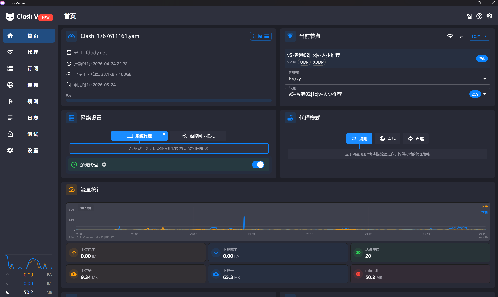

# Clash Verge 使用指南 

> 本指南旨在介绍网络调试类工具的安装与基本使用，请确保你了解并遵守所在地法律法规及学校网络使用规定。

模块导读见：[科学上网](../lesson/scienceweb)。

## 软件简介

**Clash Verge** 一类工具是基于 **Clash / Clash.Meta（mihomo）** 等内核的图形界面客户端，支持多种代理协议，用于网络调试与学习场景下的访问配置。

## 获取与安装

### 1. 选择发布源（重要）

原仓库 [**zzzgydi/clash-verge**](https://github.com/zzzgydi/clash-verge) 已于 **2023 年起归档（只读）**，不再有新版本。若你是**新安装**，建议优先查看当前社区维护的继任项目，例如 [**clash-verge-rev/clash-verge-rev**](https://github.com/clash-verge-rev/clash-verge-rev/releases)（以各项目 Releases 页说明为准）。

**切勿把 GitHub 上的 “Source code (zip)” 当成安装包下载**，应始终在 **Releases → Assets** 中选择对应系统的安装文件（如 `.exe`、`.dmg`、`.AppImage` 等）。

### 2. 验证文件安全性（建议）

在 Releases 页面，作者通常会提供文件的 **SHA256 / SHA512** 校验值。

在 Windows PowerShell 中示例：

```powershell
Get-FileHash -Path "你下载的安装包完整路径\文件名.exe" -Algorithm SHA256
```

将输出值与页面公布的校验值**完全一致**后再安装。

### 3. 安装与运行

按各系统常规方式安装；首次运行若提示权限或网络权限，请仅在可信前提下授予。

## 基础配置

1. 准备或获取符合 Clash 语法的配置文件（常见为 `.yaml` / 订阅链接，**来源须可信**）。
2. 在客户端中**导入**配置或订阅。
3. 在界面中选择节点、按需开启**系统代理**或**规则模式**（以软件文案为准）。  
如图：  


## 注意事项与风险

- **安全风险**：第三方订阅与配置可能包含未知节点，请从可信渠道获取，并定期更新客户端。
- **合规使用**：仅用于学习、科研等合法目的；请遵守《网络安全法》及学校网络管理规定。
- **资源占用**：长期后台运行会占用少量内存与电量。

---

> 本指南由zzming-tjufe维护，如有疑问请联系：`zzming2019@hotmail.com`  
> 最后更新：2026年4月19日
